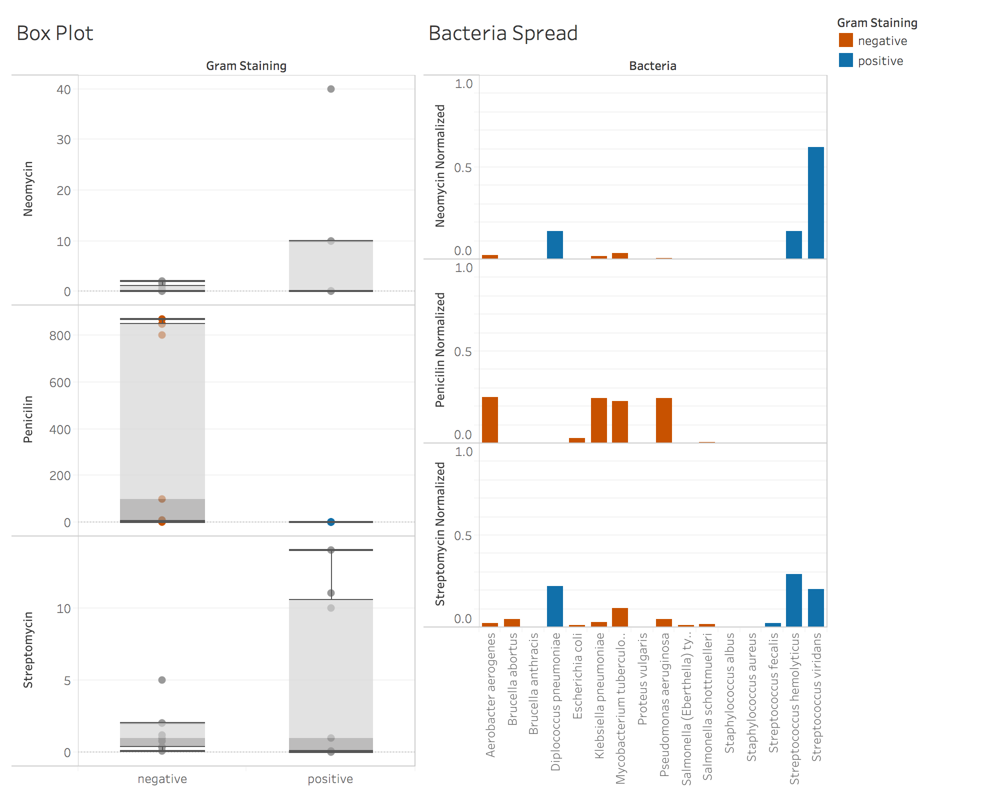

*Assignment 1
**Antibiotics data
**Mary Huibregtse 

**Image**

**Writeup**
*Box Plot*
I chose a box plot because it shows a spread of the data and provides min, max, and average in a visually pleasing and consumable way. It also makes outliers easy to identify, and gives the viewer and idea of the distribution. 

*Bar Chart*
The bar chart is great for seeing the *percentage* of Streptomycin, Penicilin, and Neomycin in each strain of bacteria. Since the sum of each mold ranges greatly, I normalized the ranges so that comparison is possible. I also chose to stack one mold on top of another to make comparing different strains of molds visually pleasing and fairly easy. Colors friendly to colorblind people were used to accomade all levels of eyesight. 

